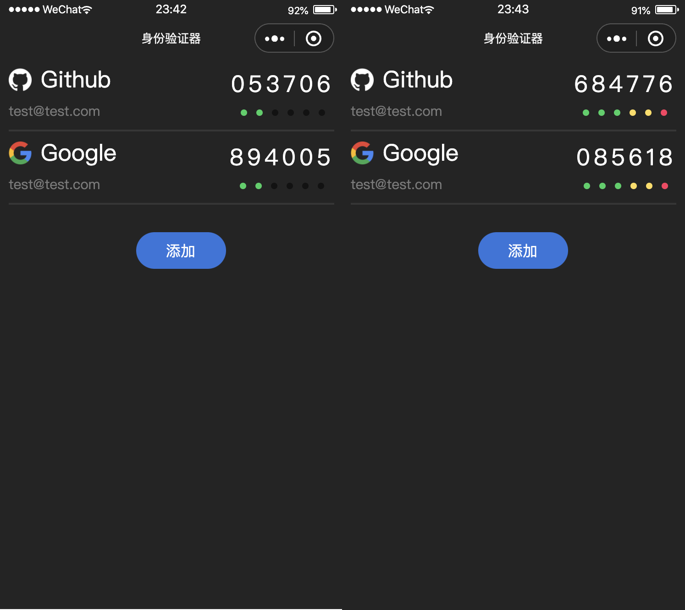

# TOTP-Miniapp

#### 项目背景

我将大部分网站的账号都设置了基于 TOTP 的二步验证，只要在手机上装一个谷歌身份验证器就能便捷的查看动态验证码，这样既不用等待短信下发的延迟也保证了账号的安全。直到有一天我的手机屏幕摔坏了，无法正常显示，这些网站因为我不能提供动态验证码都无法正常登录。本项目就是为了解决这类少见却又真实存在的场景带来的不便。

#### 已实现的功能

- 生成动态验证码
- 倒计时提醒
- 扫码添加数据
- 防止重复添加

#### 开发中的功能

- 云端数据备份与还原

#### 功能预览

